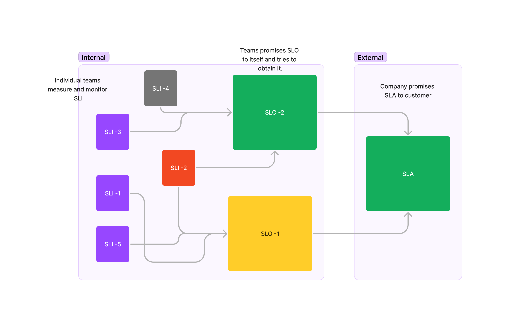

## Introduction

Unfamiliar with SLA, SLO, and SLI terms? Don't fret! This article simplifies and demystifies these acronyms, revealing their straightforward nature. These terms refer to:

SLI --> Service Level Indicator
SLO --> Service Level Objective
SLA --> Service Level Agreement

## Example

Imagine you're ordering food from a restaurant. The restaurant tracks their delivery times carefully. They monitor how long it takes to prepare each order, how long it takes for the delivery person to pick up the food, and how long it takes the delivery person to get the food to your doorstep. These data points are their Service Level Indicators (SLIs).

> SLI(s) are data points (metrices) for business or software.

Now You want to get your meal delivered quickly and hot. The restaurant assures you that they'll deliver your food within 30 minutes. This promise is their Service Level Objective (SLO).

In simpler terms, an SLI is a metric that measures how well a service provider is meeting their SLOs. It's like a speedometer telling you how fast you're driving. SLI(s) dervices SLO(s).

> SLO is a agreement between interal team --> internal stackholders

In case of food delivery, 30 min promise to internal team is SLO and promising the same to customer is SLA.

> SLA is agreement from internal stackholders --> external stackholders

Here is the mental picture:

## But why?

> It determine "What matters to company?" Promise sets foucs for Team.

If there is a problem with customer, first thing is to determine "How critical it is?" and sets the tone of the problem. This sets the team's focus areas and happy customer.
